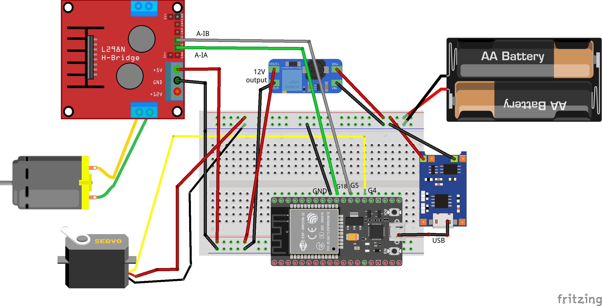

# T-onsite-Racer 
**T-Systems on site services GmbH**

Workshop Documentation for T-onsite Racer @ CMD+O

## Respository structure

**root directory:** Building instruction and programming instructions to build T-onsite-Racer.

**Groupwork**: Introdcution to Bluetooth Low Energy and Microcontroller.

**CAD::** T-Racer CAD Files.

**Arduino:** Template sketch as "programming guide" for the T-Racer and sample solution.

**App:** Link and introdcution to download the T-Racer app directly from AppStore/PlayStore to controll your car. For Android there is an prebuild apk. You can also find the source code of the app in the subdirectory "sources".

**images:** Pictures and impressions of the T-Racer.

## App

We have a prebuild IOS and Android app, which can be officially downloaded as a trial version in the respective stores. You can find the link to the app for your platform in the app subfolder.

You can also find the source code here. So you can build your app for the corresponding platform. The app is implemented in ionic and can be built for both, android and ios. First the development/build environment has to be configured accordingly:

1. Clone this repo
2. Install Node.js current version (https://nodejs.org/en/download/)
3. Install the Ionic CLI with npm in CMD - npm install -g @ionic/cli (https://ionicframework.com/docs/intro/cli)
4. Download Android SDK and JDK8 (https://ionicframework.com/docs/developing/android)
5. Download Gradle and set Path to System (https://gradle.org/install/)
6. Use IDE for modifications: example (Visual Studio Code - https://code.visualstudio.com/)
7. In project directory, install nippljs - npm i nipplejs (https://www.npmjs.com/package/nipplejs)

How to deploy on android device:
Note: Compatible with Android 5.2 and higher.

1. In project directory, run - ionic cordova prepare android (https://ionicframework.com/docs/cli/commands/cordova-prepare)
2.  In project directory, run - ionic cordova run android -1 (to deploy on android Phone: https://ionicframework.com/docs/cli/commands/cordova-run)

Visit "https://ionicframework.com/docs" for complete documentation.

## T-Racer "tuning"

To make the T-Racer a bit faster, you can buy a new engine, for example with 900rpm. Make sure that the dimensions are correct, otherwise it won't fit into the provided holder.

You can also turn up the step-up converter to 10-12V to get the maximum power out of your motor. 
Attention: The servo motor has an operating voltage of 5V. According to the wiring diagram, the servo is connected to the output of the step-up. If the step-up is turned up to over 5V, the servo must be replugged. You can then connect the servo motor directly to the battery.

